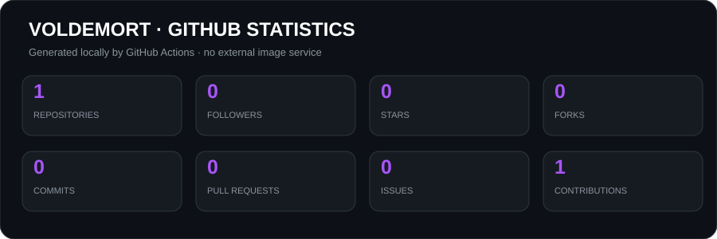
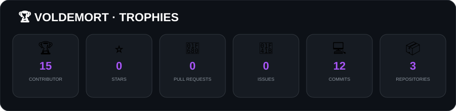
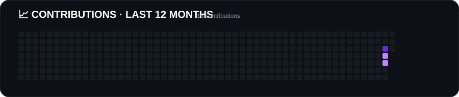

# ╔═══ ❖ **VOLDEMORT** ❖ ═══╗

<div align="center">

### `Developer • Builder • Creator`

**GitHub:** [robalex01](https://github.com/robalex01)  
**Discord:** `6voldemort`  
**Pro:** `6voldemort69@gmail.com`

<br>

> **「 Building things. Breaking things. Learning everything. 」**

`⚡ FiveM`　`🎮 Roblox`　`🌐 Web`　`🧠 Software`　`🛠️ Tools`

</div>

---

<div align="center">

## ╭━━━ ✦ ABOUT ME ✦ ━━━╮

</div>

```yaml
name: Voldemort
username: robalex01

role:
  - Developer
  - Project Builder
  - Server Developer

interests:
  - FiveM
  - Roblox
  - Web Development
  - Software Development
  - Automation

currently:
  - Building new projects
  - Learning new technologies
  - Experimenting with new ideas
```

<div align="center">

`╰────────────────────────────────────────────╯`

</div>

---

<div align="center">

## ╭━━━ 🚀 PROJECTS ━━━╮

</div>

### 🏭 Factory Empire

> Roblox factory / tycoon game focused on automation and production.

`Roblox` `Lua` `Factory` `Automation`

**Mine → Transform → Assemble → Ship**

### 🎮 Alkia RP

> FiveM roleplay project with custom resources and systems.

`FiveM` `Lua` `ESX` `ox_lib` `oxmysql`

**Custom scripts • Administration • Jobs • Discord integration**

### 🧩 Git Architect

> Visual Git project manager designed to make Git easier to understand.

`Electron` `Vite` `TypeScript` `Git`

**Visual Git workflows • Repository management • Developer tools**

---

<div align="center">

## ╭━━━ 🛠️ TECH STACK ━━━╮

### Languages

`Lua` · `JavaScript` · `TypeScript` · `Python`

### Frameworks & Tools

`React` · `Node.js` · `Vite` · `Electron` · `Git`

### Platforms

`FiveM` · `Roblox` · `Windows`

</div>

---

<div align="center">

## ╭━━━ 📊 GITHUB STATISTICS ━━━╮

<br>



<br><br>


</div>

---

<div align="center">

## ╭━━━ 🏆 TROPHIES ━━━╮

<br>



</div>

---

<div align="center">

## ╭━━━ 🐍 GITHUB SNAKE ━━━╮

<br>

<picture>
  <source media="(prefers-color-scheme: dark)" srcset="./assets/github-snake-dark.svg">
  <source media="(prefers-color-scheme: light)" srcset="./assets/github-snake.svg">
  
</picture>

</div>

---

<div align="center">

## ╭━━━ 📈 CONTRIBUTIONS ━━━╮

<br>



</div>

---

<div align="center">

## ╭━━━ 🚀 PROJECTS ━━━╮

<br>

**🏭 [Factory Empire](https://github.com/robalex01/Factory-Empire)**  
Roblox automation / factory tycoon

**🧩 [Git Architect](https://github.com/robalex01/Git-Architect)**  
Electron / Vite visual Git tooling

**🎮 Alkia RP**  
FiveM custom roleplay ecosystem

</div>

---

<div align="center">

## ╭━━━ ⚡ CURRENTLY WORKING ON ━━━╮

</div>

```text
╭─────────────────────────────────────────────╮
│                                             │
│   🏭  Factory Empire                        │
│       └─ Roblox automation / tycoon         │
│                                             │
│   🎮  Alkia RP                              │
│       └─ FiveM custom ecosystem             │
│                                             │
│   🧩  Git Architect                         │
│       └─ Visual Git tooling                 │
│                                             │
╰─────────────────────────────────────────────╯
```

---

<div align="center">

## ╭━━━ 🎵 NOW PLAYING ━━━╮

<br>

`🎧 Listening • Coding • Building`

</div>

---

<div align="center">

## ╭━━━ 🌐 CONNECT ━━━╮

<br>

**GitHub:** [robalex01](https://github.com/robalex01)  
**Discord:** `6voldemort`  
**Pro:** `6voldemort69@gmail.com`

</div>

---
